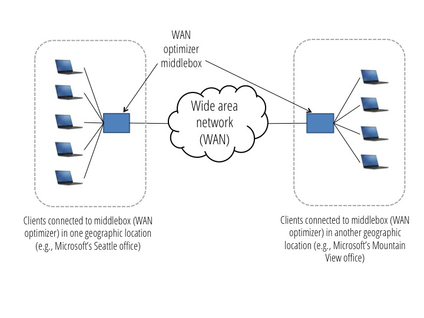
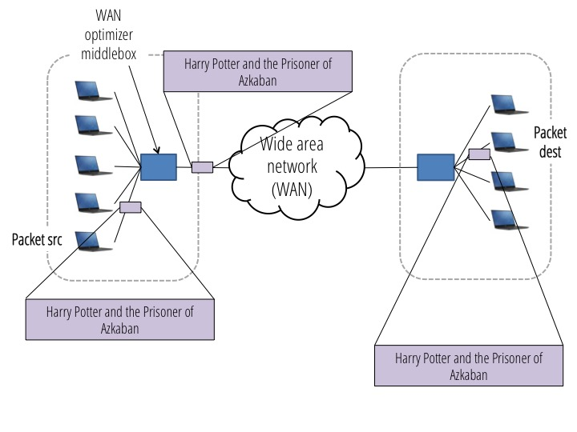

# Wan Optimizer

In this assignment, you'll build a middlebox application that optimizes the amount of data transmitted over a wide area network (WAN). The sending and receiving clients will be unaware of the middleboxes that do the optimizations.

#### Background

Enterprises often have multiple locations that they're sending data between, which are connected by a network that the enterprise pays to use. For example, Microsoft has an office in Seattle, and has another office in Mountain View.  Microsoft pays for internet service from its internet service provider (ISP) (e.g., ATT) to connect the two locations.  Employees at the two offices are likely to send significant data back and forth, and Microsoft has to pay its ISP based on the amount of data transferred.

Enterprises often use WAN optimizers to minimize the amount of data that they have to pay the ISP to transport. A WAN optimizer sits in between clients in one location (e.g., employees in Microsoft's Seattle office) and the wide area network.  At other office locations, e.g., in Mountain View, another WAN optimizer sits between the wide area network and hosts at that location:

WAN optimizers reduce the amount of data sent in various ways.  For this assignment, you'll implement WAN optimizers that remember what data has been sent previously, and use this information to avoid re-sending the same data (more about exactly how to do this is detailed below).  For simplicity, you can assume that each WAN optimizer is only connected to one remote WAN optimizer (but in practice, each WAN optimizer could be connected to multiple different WAN optimmizers, all at different locations).

A WAN Optimizer is a concrete example of a middlebox application that violates the end-to-end principle, but because of the substantial benefits it provides, it has become a common occurance in the network. Companies like Riverbed and Blue Coat specialize in providing propriatary WAN Optimizer solutions to enterprise customers. You'll be building a simplified version of solutions that such companies provide.

#### Logistics

- This assignment should be implemented in Python 2.
- The project is due on Monday 12/5 at 11:59pm.
- This project can be done in groups of 2 (refer to the [course website](https://netsys.github.io/cs168fa16/about.html) for collaboration policies)
- The skeleton code for this project is available from [here](https://github.com/NetSys/cs168_student/blob/master/projects/proj4_wanoptimizer). You can download the code manually from that page, or use git.
- You'll submit your code using `ok`. You should submit two files: one named `simple_wan_optimizer.py` (for part 1) and one named `lbfs_wan_optimizer.py` (for part 2). You should not modify or submit the other python files provided.

#### Resources

- If you have questions, first take a look at the [FAQ section](#faq).  If your question isn't answered there, post to Piazza.

## Provided Code

We've provided a few files that you will need to familiarize yourself with:

  - `wan_optimizer.py`: This file defines `BaseWanOptimizer`, a class that both of your WAN optimizers should subclass.  `BaseWanOptimizer` implements a few methods that allow our test code to connect the WAN optimizer to a wide area network, and to connect clients to the WAN optimizer.  It also includes a `send` function, which you should use to send packets from the WAN optimizer.  The only method you'll need to implement is `receive`, which accepts a packet (which may be coming from the WAN, or from one of the directly connected clients) and determines where to send that packet, and whether any compression should be done. 
  - `tcp_packet.py`: This file defines the packet class that's used for sending data.
  - `wan.py`: This file defines `Wan`, a class that handles forwarding data between two WAN optimizers connected across a wide area network.  It keeps track of how much data has been sent, which we'll use to test that your WANOptimizer is sufficiently reducing the amount of data sent.
  - `client.py`: This file defines `EndHost`, a class that reads an input file, breaks that file into packets, and sends the packets over the network.  This class is used in `project4_tests.py` to test that your WAN optimizers correctly sends data.
  - `project4_tests.py`: This file defines tests you can use to verify that your code is working correctly.  It works similarly to the tests from project 3.  For example, to run the `send_less_than_one_block` test (which verifies that your WAN optimizer can correctly forward a small amount of data that's less than the part 1 block size) on the WAN optimizer in `simple_wan_optimizer.py`:

        $ python project4_tests.py --middlebox-name simple_wan_optimizer --send-less-than-one-block
        
    You may find the `--run-all` flag useful, which will run all of the tests.  The file containing each test has a description of the test's functionality; all individual test files are located in the `tests` directory.  We will run additional tests when grading your project, and you are encouraged to write your own tests.  As with project 2, you're welcome to share your tests via Piazza with others, but run other students' tests at your own risk!
      
  - `utils.py`: This file defines utility functions that may be helpful.

Packets are forwarded by calling the `receive` function on the next element in the network.  You should not be forwarding packets yourself by calling `receive`; instead, your code should use the `send` method in `BaseWanOptimizer` to send packets out a particular port.

__The only files you should modify are `simple_wan_optimizer.py` and `lbfs_wan_optimizer.py`.__

## Part 1

The first part of the assignment will help you get started with some middlebox functionality by implementing simple data de-duplication.  For this part of the assignment, you should fill in the `receive` method if the `WanOptimizer` class defined in `simple_wan_optimizer.py`.

To understand the functionality you should implement in part 1, let's walk through a simple example.  Suppose the following data is sent over the network:

    Harry Potter and the Prisoner of Azkaban 
    
The diagram below shows the original data traveling across the network. The purple boxes show the packet at different locations as it traverses the network, and the expanded version of each packet shows the payload of the packet.

    
Here, the payload of the packet is the same as the packet travels through the network.  Now, suppose that the same data is sent again.  The idea of the first WAN optimizer is to keep track of blocks of data that have already been sent, and associate each block with a key.  For example, the WAN optimizer might keep track of 10-character blocks (each block is shown with its associated key, and with quotes around it, to make it easier to see spaces):

    0: "Harry Pott"
    1: "er and the"
    2: " Prisoner "
    3: "of Azkaban"
    
Now, if the WAN optimizer sees the same sentence again, instead of sending the sentence, the WAN optimizer could just sent the (shorter) keys:
 
     0, 1, 2, 3
     
  The WAN optimizer on the other side of the WAN, on receiving these keys, would replace them with the complete data before forwarding the packet(s) on to the destination.  The diagram below shows the data that will be sent over the network:
  

Note that the clients are oblivious to the WAN optimizers: from the client's perspective, they're sending and receiving the same data as they would be if the WAN optimizer didn't exist.

There are a few key questions to address:

#### How does a WAN optimizer know whether a packet contains data, or a key that should be translated to data?

Many protocols make use of the FLAGS field in the TCP header for purposes like this.  For this assignment, the Packet class has a boolean `is_raw_data` flag that your WAN optimizer should use to determine whether a packet has data (if the flag is true) or if the packet contains a key that should be translated to raw data by the receiving WAN optimizer.  Clients always send data with this flag sent to false; the flag is only set to true when data is sent between two WAN optimizers.

#### How does each WAN optimizer know how to translate between keys and actual data?

The simple example above used the order of data to translate between keys and actual data: the first 10 characters had key 0, the second 10 characters had key 1, and so on.  For this assignment, you'll instead use a hash.  The WAN optimizer that sends data will compute the hash of each block of data before sending it, and store a mapping between the hash and the raw data.  The receiving WAN optimizer, when it gets raw data, will similarly compute the hash, and store the mapping between the hash and the raw data.  Hashes are convenient because they allow both WAN optimizers to compute the same key for the same data, without actually sending the keys between the two WAN optimizers.  If the same data is sent again later, the sending WAN optimizer sends just the hash, with `is_raw_data` set to false.  Since the receiving WAN optimizer had previously received the corresponding raw data, it will have the hash (and corresponding original data) stored, and can use the stored values to replace the hash with the raw data before sending the packet on to the client. The `utils.py` file has a function you can use to compute the hash.

One important difference from the example above is that, when your WAN optimizer sends a hash, it should send just one hash per packet (for brevity, the example above showed all of the keys sent in a single packet).

#### What size should packets be?

For all communication the packet size should be less than or equal to `utils.MAX_PACKET_SIZE` (1500 bytes).

#### How should data be split into blocks?

Determinig how to split data into blocks is the key challenge of implementing a WAN optimizer.  In this project, you'll implement two different approaches, one for each part of the project.  For the first part, you'll split data into fixed size blocks that are of size 8 kilobytes (this constant is defined in `simple_wan_optimizer.py`).  Because the maximum packet size is only 1500 bytes, you will need to buffer packets in your WAN optimizer in order to create 8 kilobyte blocks.  You should buffer as little as possible, and you should *not* wait for a fin packet to split the data in a flow into blocks.  For example, suppose your WAN optimizer that's connected to a sending client first receives 3 maximum-sized packets:

    Packet 0: 1500 bytes
    Packet 1: 1500 bytes
    Packet 2: 1500 bytes
    
At this point, the WAN optimizer should not send any data over the WAN, because it hasn't yet received a complete block, so doesn't know whether the raw data needs to be sent or if there's a match in the cache of blocks that have already been sent.  Now suppose you receive 3 more packets:

    Packet 3: 1500 bytes
    Packet 4: 1500 bytes
    Packet 5: 1500 bytes
    
At this point, the WAN optimizer has received 9000 bytes, so enough to send one block.  The WAN optimizer should send either a hash (if the first 8000 bytes have been sent previously) or the 8000 bytes of raw data, and should buffer the remaining 1000 bytes until it receives the remaining 7000 bytes for the 2nd block.

#### Why break data into blocks?

You may be wondering why data should be broken into blocks instead of, for example, just using the payload of each packet.  The reason for using a specific block size is that the same data may be broken into different packets when it's resent.  For example, for the example payload above:
 
     Harry Potter and the Prisoner of Azkaban 
        
   All of the text might be first sent as the payload in a single packet.  The next time it's sent, it might be split up into two packets, the first of which contains:

    Harry Potter and the 
      
and the second of which has the rest:
  
    Prisoner of Azkaban 
    
Using a fixed block size helps guard against data that's split into different packets.  Note that even if a host is always sending packets of the same size, packets may be fragmented in the network.  Also, keep in mind that even a single stream of data may have multiple blocks that are the same.

#### What happens when a stream of data ends and a full block of data hasn't been sent?

Data streams will often end in places that are not on a block boundary.  For instance, in the example above, if Packet 5 were the last packet (i.e., had `is_fin` set), the last 1000 bytes don't make up a complete block. In this case, you should just store a hash for the remaining smaller block.

#### What assumptions can I make about the stream of packets?

You can assume all packets arrive in-order, and that there's no packet loss.

#### Should all of the tests pass for my part 1 WAN optimizer?

Yes.  You'll notice that the implementation provided in `simple_wan_optimizer.py` forwards packets without any data reduction, and if you run the tests with the provided code, all but 2 of the tests will pass.  This is because the remaining tests check for correctness, and may fail as you implement the WAN optimizer functionality.

## Part 2

While the above mentioned algorithm works well for the same file is sent over again and again, as soon as we change (by insertion or deletion) the file even a bit, the data de-duplication breaks down (Think about why this happens and in what cases?). In order to have a more robust data de-duplication scheme, we need a better algorithm for our WAN optimizer. Think about how what such an algorithm would look like?

Details will be released later on how to implement the more sophisticated middlebox data-deduplication algorithm.

##FAQ

#### What is the length of the hash?
The function provided in `utils.py` uses SHA1 hash function. The SHA1 function outputs a hash of length 20 bytes.

#### Is it ok if the WAN optimizer packetizes (i.e., breaks a stream of data into packets) differently than the client?

Yes.  Your WAN optimizer should not re-order data, but you're welcome to break data into packets however you see fit.  For example, if a client sent one packet with an 8 byte payload:

     Payload!
     
It would be fine if your optimizer split this into multiple packets; e.g., first

    Pay
    
and later

    load!
    
#### Should the WAN optimizer change the source or destination address?

No.  For all packets, the source address should be a client, and the destination should be another client.  Packets should not be directly addressed to middleboxes (because the middleboxes are directly on the path between the clients, they can intercept traffic without having the traffic directly addressed to them).  The `Wan` class will throw an error if you modify the source or destination address.

#### Can I assume packets are received in-order?

Yes.

#### Can I assume that there's no packet loss?

Yes.

#### Does my WAN optimizer need to deal with multiple concurrent sources, or with sources that are sending data to multiple destinations?

Yes.  Your WAN optimizer should correctly handle multiple concurrent "flows", where is a flow is defined by a paticular (source, destination) pair.  The blocks of data hashed should consist of 8000 consecutive bytes for a particular flow.

If you consider a smaller example where the block size is just 5 bytes, suppose Aisha sent to Scott:

    aa
    
And then Aisha sent to Panda:

    Hi Panda!
    
And Aisha later sent Scott:

    Oops!
    
The WAN optimizer should store hashes for the block "Hi Pa" (for the flow from Aisha to Panda) and "aaOop" (for the flow from Aisha to Scott).  The remaining bytes won't yet have an associated hash, because they don't fill all 5 bytes needed for a block.

#### Is it OK if the WAN optimizer stores all data for a particular flow until it gets a FIN packet, and then packetizes and sends all of the data at once?

No.  Your WAN optimizer should send data incrementally as 8000 byte blocks are received.  See [this section](#how-big-should-each-block-be) for more.

#### Can FIN packets contain data?

Yes.

#### What happens if a FIN packet is never received for a particular flow, or if there's a long pause in sending for the flow?

You don't need to consider this case.

#### How should I handle the case when the WAN optimizer receives a packet with a hash that it's never seen before?

You don't need to worry about the case when the WAN optimizer receives an invalid hash.

#### Does my WAN optimizer need to handle traffic between two clients that are both connected to the same WAN optimizer?

No, you don't need to handle this case.  You can assume all traffic will traverse both WAN optimizers.
